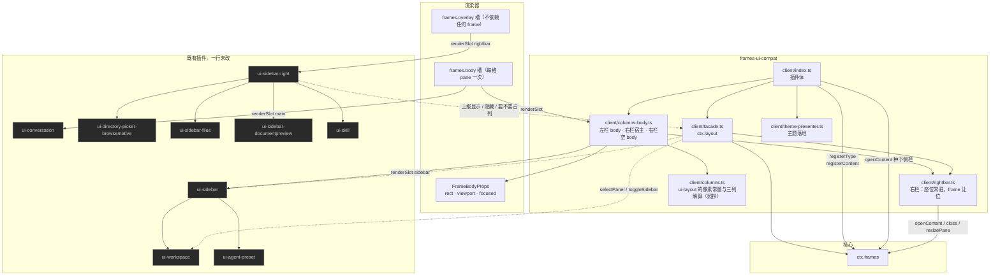
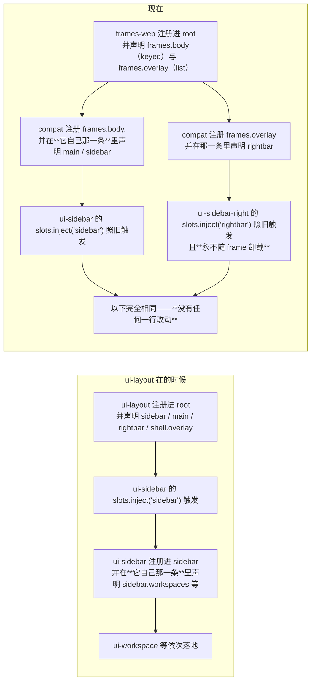
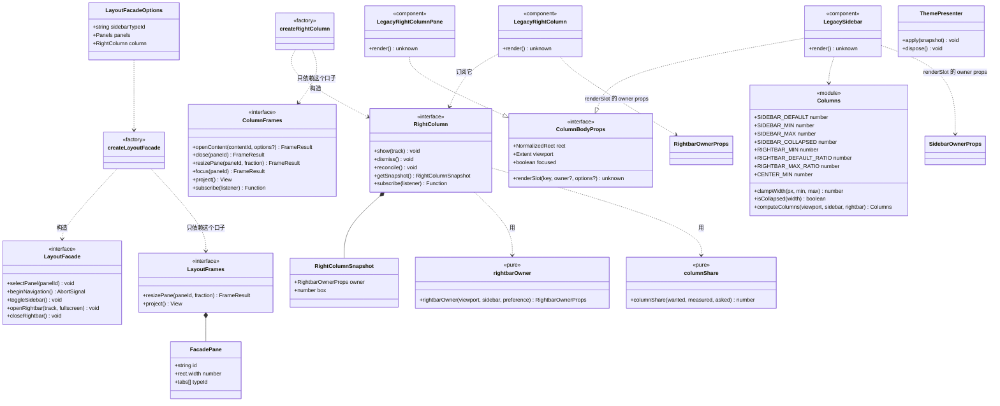
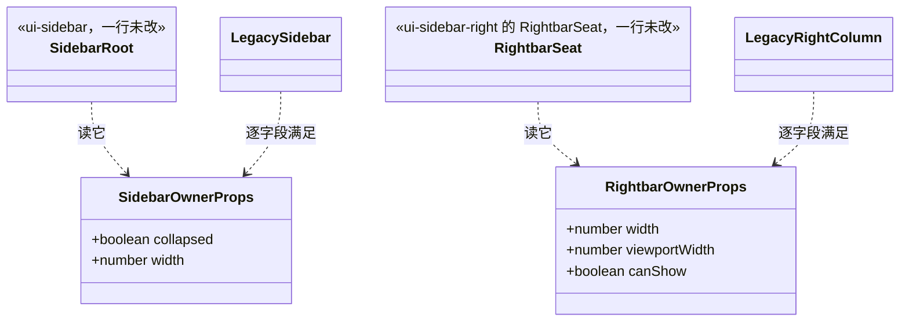

# `@deepseek-ai/dsh-client-frames-ui-compat` 设计

> **本包是兼容层。** `ui-layout` 被禁用之后，它接管 `ctx.layout`、四个 legacy 座位与主题落地，让**一行不改**的既有插件照旧工作。
> 核心见 [`../frames/DESIGN.md`](../frames/DESIGN.md)，渲染器见 [`../frames-web/DESIGN.md`](../frames-web/DESIGN.md)，三仓关系见 [`frame-manager-design.md`](../../../frame-manager-design.md)。

---

## 1. 职责边界

| | 知道什么 | **绝不知道** |
|---|---|---|
| 本包 | `ui-layout` 的全部接口与槽键名、owner props 的形状、主题怎么写进文档、**哪一列由哪个占据者决定显隐** | frame 树怎么组织、操作怎么应用、预设怎么存 |

**它不是"给旧代码打补丁"，而是一份公开接口的第二实现。** `ui-workspace`、`ui-sidebar`、`ui-sidebar-right` 注入 `ctx.layout` 并往里调；**它们那边什么都不知道**。

**一条贯穿全包的分工**：legacy 的"槽"与 frame 的"格"不是一回事。座位属于**内容**（插件一旦挂载就常驻），frame 只是**显示它的地方**——谁显谁隐、多宽，由占据者通过 `ctx.layout` 上报，由本包换算成 frame 树上的动作。两侧最容易错的地方见 §3.1 与 §4。

---

## 2. 框架图

### 2.1 它接住了什么



> **两条进路，一种理由。** 左栏的 frame 一直在（折叠只是变窄），所以它的座位画在 frame 里；右栏的 frame 只在面板显示时才存在，所以它的座位画在 `frames.overlay` 上——那是渲染器**不依赖任何 frame** 就绘制的一层。把右栏的座位画在它自己的 body 里会成环：frame 是因为占据者上报"我显示了"才开的，而占据者只在 frame 被画出来时才挂载。

### 2.2 声明权在注册条目



**支点是一条框架规则**：一个注册条目可以**声明自己的子座位**。所以只要有人在 `frames.body` / `frames.overlay` 下把 `sidebar` / `main` / `rightbar` 声明出来，既有插件的 `slots.inject(...)` 就会照常触发。

> ⚠ **声明即独占渲染权。** 一个座位只能有一个声明者。所以 compat 是**三个** `frames.body` 条目加**一个** `frames.overlay` 条目，各声明自己画的那个座位（`main`+`shell.overlay` / `sidebar` / 右栏的空格 / `rightbar`）。
>
> **座位声明在哪一条里，决定了它活多久。** 声明在 `frames.body` 里的座位跟着那一格 frame 的生死；声明在 `frames.overlay` 里的座位跟着 compat 自己（也就是插件与内容）的生死。右栏必须是后者——理由见 §6。

---

## 3. 静态类图



### 3.1 owner props：桥接最容易失败的地方



**换算方向必须成对**：body 从渲染器拿到**归一化矩形 + viewport**，换成 px 喂给占据者；占据者要改宽度时，compat 再换回**父级占比**调用 `resizePane`。

```
rect.width × viewport.width  →  SidebarOwnerProps.width        （画）
wanted        ÷ viewport.width  →  resizePane(paneId, share)     （改）
```

**右栏这一对还要多一层，而且方向是反的**：

| 占据者被告知 | 从哪来 | 为什么不是 frame 的当前宽度 |
|---|---|---|
| `width` | 面板**显示时**这一列会占的 px（记住的宽度，或首开 `viewport × 0.45` 经三列解算） | 面板隐藏时没有 frame，当前宽度是 0；而 `RightbarSeat` 一旦看到"显示中 + `canShow:false`"就把自己按回去（`SidebarRight.tsx:377-379`），它的上报又比这个判断晚一次提交 |
| `canShow` | 视口里**还有没有位置**（`computeColumns` 的判定：`viewport − 左栏 − CENTER_MIN ≥ RIGHTBAR_MIN`） | 同上：资格判定必须与"显示"同源。出厂原话在 `AppFrame.tsx:165-168`：*Eligibility must include that space before the occupant's first shown report arrives* |
| `box`（画在哪） | 显示且要占列时 = 上面那个 `width`；否则 **0** | 0 宽的盒子什么都不画、也不吃点击，这就是"隐藏不花钱" |

> ⚠ **两处偏离出厂、必须记住的地方**：
> ① 出厂的三列由 `computeColumns` 从**偏好**解出，所以开右栏只会压缩**中央**；这里核心给一格宽度是**按兄弟比例分摊**的，因此右栏占位时**左栏也会让出一点**。这在 §6 里由 compat 在收栏时补回去——否则每开合一次，侧栏就会被挤窄一点（`settledSizes` 把释放的份额给中央，不会把轨还给左栏）。
> ② 右栏的 frame 宽度就是面板宽度（同一个数），但**不是** owner props 里的 `width`：`width` 是"若显示会占多宽"，frame 是"现在实际占了多宽"。两者在显示时相等，在隐藏时后者不存在。

---

## 4. 五个调用的确切语义

| 调用 | 语义 | 本包怎么做 |
|---|---|---|
| `selectPanel(id)` | 切中央面板；未注册的 id **抛错**且不改选择 | 判定权交给核心（`frames.hasType`），因为注册表在核心手里 |
| `beginNavigation()` | 发起一次导航，作废上一个 | `AbortController`，下一次导航或卸载时 abort |
| `toggleSidebar()` | 折叠 ⟷ 展开（**不是**存在 ⟷ 不存在） | 改侧栏 frame 的占比：56px 轨 ⟷ 上次的宽度 |
| `openRightbar(track, fullscreen)` | **上报**：我显示了，`track` 说明要不要占一列 | 要让位 → 开右栏 frame 并调到记住的宽度；`track=false`（面板铺满视口）→ **不占列**（面板自己 `position:fixed; inset:0`） |
| `closeRightbar()` | **上报**：我隐藏了 | 关右栏 frame，并把左栏当初让出的那点宽度还回去 |

> **两个最容易搞错的**：`toggleSidebar` 不是"显示/隐藏"——出厂的网格里那一列**从不消失**，折叠时它变成 56px 图标轨，占据者自己画那根轨。`openRightbar` / `closeRightbar` **不是命令而是上报**，方向是反的：**占据者决定自己显不显示**，然后告诉外壳留多少位置。
>
> 而"关掉右栏"在这里**不是卸载座位**，只是不再有那一格 frame——座位在 `frames.overlay` 上，一直活着。这条是 §6 的核心。

---

## 5. 照抄的常量

`client/columns.ts` 里的像素常量、`clampWidth` / `isCollapsed` 与**三列解算 `computeColumns`**，来源是第三方工程的
`packages/client/ui-layout/src/client/columns.ts`。

**为什么照抄**：它们是**数字不是类型**，`import type` 拿不到；而运行期 import 会拖进一个刻意没挂载、且在模块顶层拉 React 的包。出处与理由写在文件头，**这里是与上游分歧必须被记录的地方**。`computeColumns` 同理：右栏要告诉占据者"你若显示会占多宽"，那个答案必须是出厂的答案，而不是这里新发明的一条规则。

一处我们与上游**故意不同**：`minPaneSize` 是 72px，而折叠轨是 56px。这不冲突——`minPaneSize` 回答的是"一次分裂能不能留下两个可用半边"，与"一列可以被要求多窄"是两个问题。

---

## 6. 它种下的东西，以及它不再种的那一个

挂载时 compat 会：

1. 注册三个类型（`legacy.conversation` / `legacy.sidebar` / `legacy.rightbar`）。两个列类型里，左栏是 `{ grows: false }`——旁边的格子关掉时它不跟着长；右栏**必须可关**，因为"隐藏"就是关掉它那一格。**左栏也可关**，而且理由与右栏同源：它由**本层**立起来（下面第 3 条），关掉之后下一次对账会把它立回来。它曾经声明 `closable: false`，那个声明是错的——策略是**类型**的属性，于是任何显示导航面板的格子都关不掉，包括用户从选择列表里给自己开的那一格（T24）；
2. 注册两个内容（侧栏与右栏）——**先注册内容**是"关掉还能回来而不被重建"的前提；
3. **种下侧栏，并且是"对账"而不是"种一次"**：本层记住自己立起来的那一格（`navPane`）；那一格不在了、而且导航内容**没有任何一格在显示**时，`openContent('legacy.sidebar', { place: 'left' })` 再 `resizePane` 到 280px；
4. 把焦点还给中央——开一格会聚焦它，而 shell 应该开在内容上；
5. **把右栏的座位挂到 `frames.overlay` 上**，并把它的 frame body 注册成空——于是面板从挂载那一刻起就在运行，而那一格 frame 只是它的位置。

**右栏刻意不种**：出厂的 shell 本来也没有右栏，而它现在**不需要**被种——座位常驻，占据者会自己上报"我隐藏了"，等到有人展开时再上报"我显示了"，那一格 frame 就出现。

> 对账需要渲染端已报测量值，而两个插件的挂载顺序这一层控制不了，所以第一次会失败、由下一次变化重试——**成功之后仍然继续对账**（这正是左栏能重新立起来的原因），但只在"导航内容一处都没显示"时才动手：用户把导航面板放进自己的格子时，那一处就是它，本层不再立第二份。
>
> **核心默认没变**：不挂本包的 profile 仍然只有一个 frame。

### 6.0 为什么"哪一格显示了这一列的内容"不等于"哪一格是这一列"

选择列表列出的是**内容**，而外壳必须注册这些内容（frame 显示的就是内容），所以 `legacy.sidebar` / `legacy.rightbar` 必然出现在列表里，用户可以把它们放进自己的格子。于是本层的每一处几何都必须认**自己开出来的那一格**（`navPane` / `columnPane`），不能认"哪一格显示了这一列"：

| 读法 | 误认的后果 |
|---|---|
| 右栏宽度解算按"显示右栏内容的格" | 用户那一格被当成右栏，解算出来的宽度与它无关 |
| 关闭右栏时还给左栏的宽度按"显示导航内容的格" | 去 `resizePane` **用户的**格子 |
| `toggleSidebar` 按"显示导航内容的格" | 折叠按钮把用户的格子折成 56px |
| `closable: false` 写在类型上 | 用户的格子**根本关不掉**（T24 报障） |

这是 T21 为右栏学到的教训，T24 把它在左栏补齐；例外只有一处，而且是有意的：`toggleSidebar` 在**本层那一格不存在**时回退到"显示导航面板的那一格"——因为折叠按钮画在面板自己身上，面板在哪一格，按钮就该作用在哪一格。

### 6.1 为什么右栏的座位不能画在它自己的 frame 里

这是本节唯一值得单独写下来的事，因为它是一个**环**：

```
要开那一格 frame  ⇐  占据者上报"我显示了"  ⇐  占据者挂载  ⇐  renderSlot('rightbar')  ⇐  那一格 frame 被画出来
```

出厂没有这个环，因为出厂的外壳里**右栏座位始终被渲染**（`AppFrame.tsx:226-228` 无条件 `renderSlot('rightbar', …)`，关闭时只是网格轨道宽 0）。frame 模型里没有"占位但不画"的一格：`resizePane` 的下限是 2%（`MIN_RESIZE_FRACTION`），占比 0 在引擎里直接抛错。所以"隐藏"只能是**没有这一格**，而那要求座位挂在**不依赖 frame** 的地方——就是 `frames.overlay`。

三条被否掉的替代路，免得下次再走：

| 想法 | 为什么不行 |
|---|---|
| 把右栏也种下，关掉就卸载 | 关掉后座位随之卸载，回到同一个环 |
| 隐藏 = 缩到最小占比 | 右缘永久留一条 24px 残条；且占据者被告知 `canShow:false`，展开会被它自己按回去 |
| 面板直接画在 frame 的 body 里 | 每次显隐都是一次卸载重建：卸载那一下会发一次"我隐藏了"，正好把刚开的 frame 关掉（振荡）；而且重建丢 DOM 状态（文档预览的 iframe 会重载） |

### 6.2 宽度是从哪来的，以及为什么要还给左栏

- 首开宽度 = `max(RIGHTBAR_MIN, round(viewport × RIGHTBAR_DEFAULT_RATIO))`（出厂的 `openRightbar` 原样），之后记住用户拖到的宽度；
- 记住的是**像素**，每次对账按当前视口重新解算（出厂口径）；
- **左栏的让位要还**：核心的 `resizePane` 是按兄弟比例分摊的，所以右栏占位时左栏也会窄一点；关栏时 `settledSizes` 把释放的份额给中央、**不会**把轨还给左栏。不还就会出现"每开合一次侧栏窄一点"的棘轮，`rightbar.test.ts` 里有一条用例专门钉住它。

---

## 7. 测试

| 套件 | 守什么 |
|---|---|
| `facade.test.ts` | 未注册的 panel 抛错且不改选择、导航信号作废、`openRightbar`/`closeRightbar` 真的落到 frame 树上、内容比 frame 活得久 |
| `rightbar.test.ts` | 右栏的规则本身：无 frame 时已经"有位置"（不自我取消）、开了就有那一列且焦点留在内容上、隐藏只是收列、拖过的宽度会记住、树丢了会补、视口太窄就收列、**开合不会把侧栏挤窄** |
| `tools/plugin-runtime.test.ts` | **在 vm 里跑真实构件**：`frames.overlay` 与三个 `frames.body` 条目各声明什么、三级使能链路、`ctx.layout` 的方法齐全、开机两格且侧栏在左 280px、焦点在内容上、**无 frame 时座位已挂载且盒子宽 0 / 显示时盒子等于那一列** |
