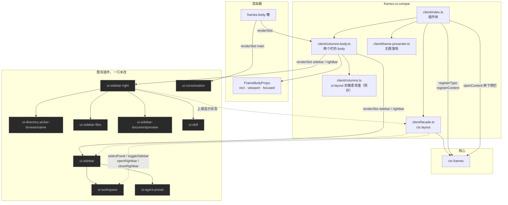
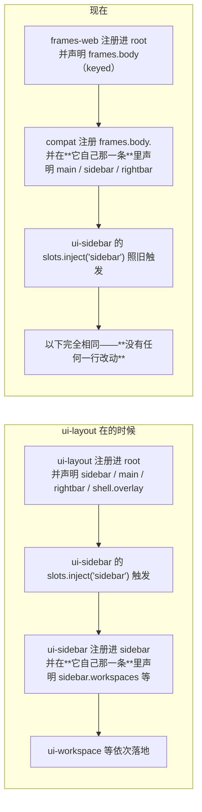
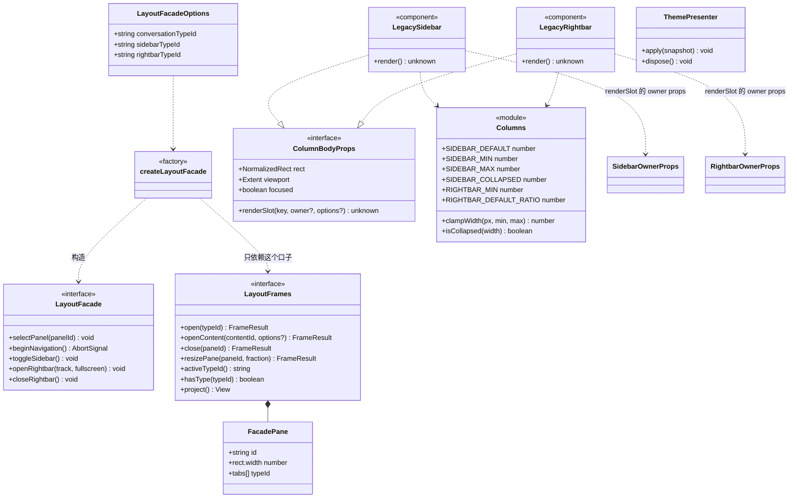
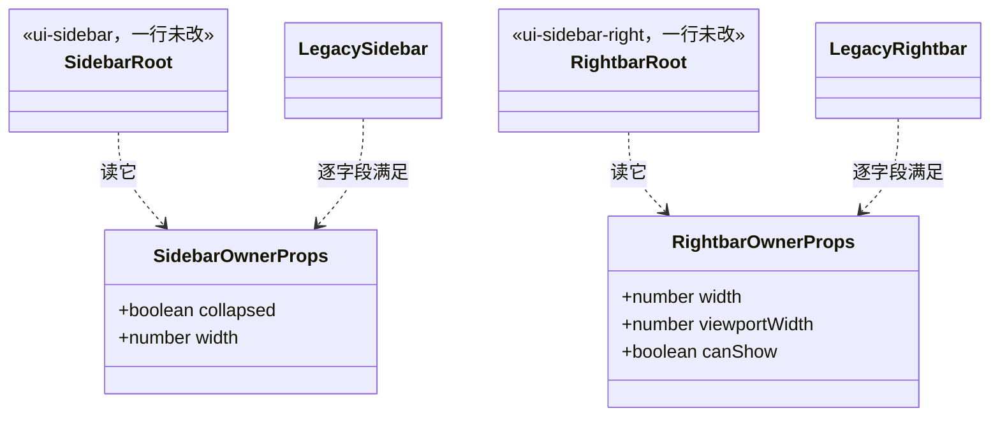

# `@deepseek-ai/dsh-client-frames-ui-compat` 设计

> **本包是兼容层。** `ui-layout` 被禁用之后，它接管 `ctx.layout`、四个 legacy 座位与主题落地，让**一行不改**的既有插件照旧工作。
> 核心见 [`../frames/DESIGN.md`](../frames/DESIGN.md)，渲染器见 [`../frames-web/DESIGN.md`](../frames-web/DESIGN.md)，三仓关系见 [`frame-manager-design.md`](../../../frame-manager-design.md)。

---

## 1. 职责边界

| | 知道什么 | **绝不知道** |
|---|---|---|
| 本包 | `ui-layout` 的全部接口与槽键名、owner props 的形状、主题怎么写进文档 | frame 树怎么组织、操作怎么应用、预设怎么存 |

**它不是"给旧代码打补丁"，而是一份公开接口的第二实现。** `ui-workspace`、`ui-sidebar`、`ui-sidebar-right` 注入 `ctx.layout` 并往里调；**它们那边什么都不知道**。

---

## 2. 框架图

### 2.1 它接住了什么



### 2.2 声明权在注册条目



**支点是一条框架规则**：一个注册条目可以**声明自己的子座位**。所以只要有人在 `frames.body` 下把 `sidebar` / `main` / `rightbar` 声明出来，既有插件的 `slots.inject(...)` 就会照常触发。

> ⚠ **声明即独占渲染权。** 一个座位只能有一个声明者。所以 compat 是**三个** `frames.body` 条目，各声明自己画的那个座位（`main`+`shell.overlay` / `sidebar` / `rightbar`）——早先合成一个条目是错的，只是当时只渲染了 `main` 才没暴露。

---

## 3. 静态类图



### 3.1 owner props：桥接最容易失败的地方



**换算方向必须成对**：body 从渲染器拿到**归一化矩形 + viewport**，换成 px 喂给占据者；占据者要改宽度时，compat 再换回**父级占比**调用 `resizePane`。

```
rect.width × viewport.width  →  SidebarOwnerProps.width        （画）
wanted        ÷ viewport.width  →  resizePane(paneId, share)     （改）
```

---

## 4. 五个调用的确切语义

| 调用 | 语义 | 本包怎么做 |
|---|---|---|
| `selectPanel(id)` | 切中央面板；未注册的 id **抛错**且不改选择 | 判定权交给核心（`frames.hasType`），因为注册表在核心手里 |
| `beginNavigation()` | 发起一次导航，作废上一个 | `AbortController`，下一次导航或卸载时 abort |
| `toggleSidebar()` | 折叠 ⟷ 展开（**不是**存在 ⟷ 不存在） | 改侧栏 frame 的占比：56px 轨 ⟷ 上次的宽度 |
| `openRightbar(track, fullscreen)` | **上报**：我显示了，请留出位置 | 开右栏 frame（若尚未开） |
| `closeRightbar()` | **上报**：我隐藏了 | 关右栏 frame |

> **两个最容易搞错的**：`toggleSidebar` 不是"显示/隐藏"——出厂的网格里那一列**从不消失**，折叠时它变成 56px 图标轨，占据者自己画那根轨。`openRightbar` / `closeRightbar` **不是命令而是上报**，方向是反的：**占据者决定自己显不显示**，然后告诉外壳留多少位置。

---

## 5. 照抄的常量

`client/columns.ts` 里的像素常量与 `clampWidth` / 简单规则，来源是第三方工程的
`packages/client/ui-layout/src/client/columns.ts`。

**为什么照抄**：它们是**数字不是类型**，`import type` 拿不到；而运行期 import 会拖进一个刻意没挂载、且在模块顶层拉 React 的包。出处与理由写在文件头，**这里是与上游分歧必须被记录的地方**。

一处我们与上游**故意不同**：`minPaneSize` 是 72px，而折叠轨是 56px。这不冲突——`minPaneSize` 回答的是"一次分裂能不能留下两个可用半边"，与"一列可以被要求多窄"是两个问题。

---

## 6. 它种下的东西

挂载时 compat 会：

1. 注册三个类型（`legacy.conversation` / `legacy.sidebar` / `legacy.rightbar`）；
2. 注册两个内容（侧栏与右栏）——**先注册内容**是"关掉还能回来而不被重建"的前提；
3. **种下侧栏**：`openContent('legacy.sidebar', { place: 'left' })` 再 `resizePane` 到 280px；
4. 把焦点还给中央——`openContent` 会聚焦新 frame，而 shell 应该开在内容上。

**右栏刻意不种**：它显不显示是占据者自己上报的事，而且出厂的 shell 本来也没有右栏。

> 播种需要渲染端已报测量值，而两个插件的挂载顺序这一层控制不了，所以是**试一次、失败就订阅重试**，成功一次就不再种（用户关掉的栏应该保持关着）。
>
> **核心默认没变**：不挂本包的 profile 仍然只有一个 frame。

---

## 7. 测试

| 套件 | 守什么 |
|---|---|
| `facade.test.ts` | 未注册的 panel 抛错且不改选择、导航信号作废、几何动作存在 |
| `tools/plugin-runtime.test.ts` | **在 vm 里跑真实构件**：三个 `frames.body` 条目各声明一个座位、三级使能链路、`ctx.layout` 的方法齐全、开机两格且侧栏在左 280px、焦点在内容上 |
